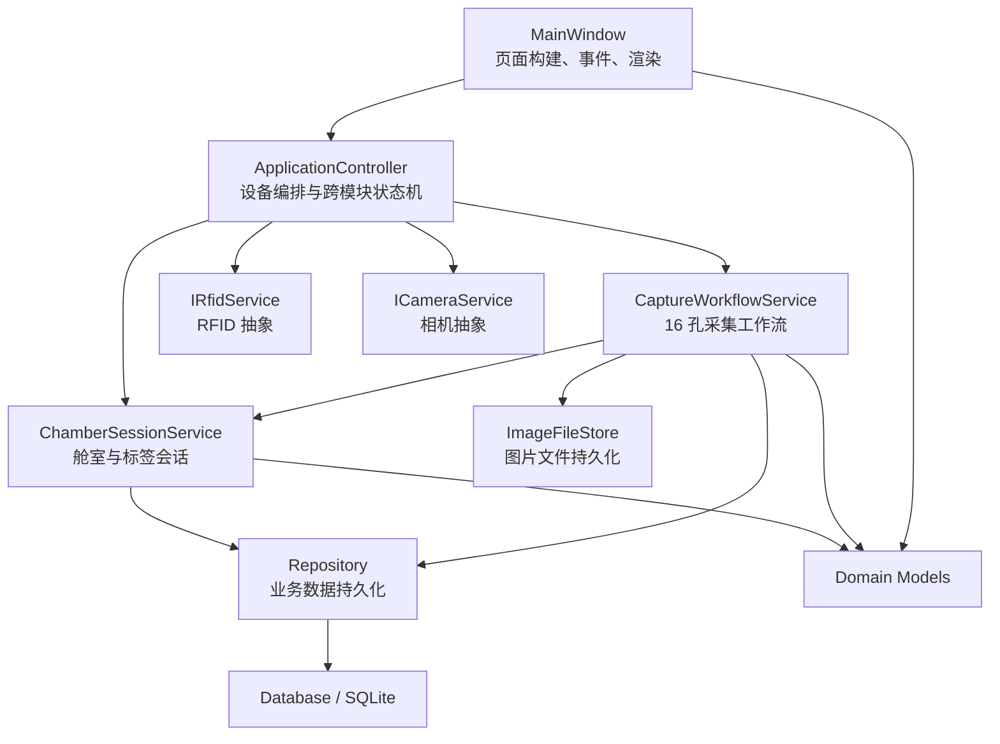
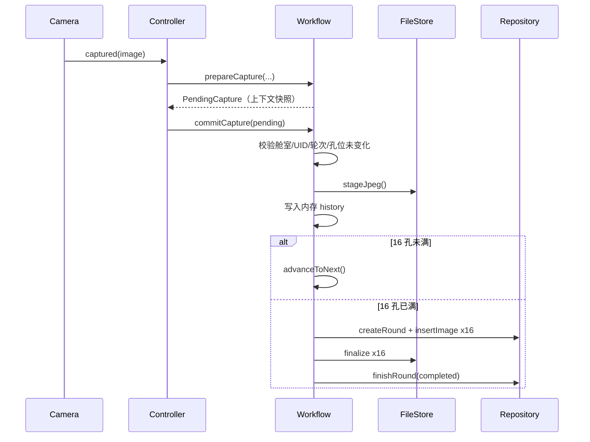

# TLS401 Demo 常规业务代码深度解析

> 目标：把当前 Demo 的业务实现从“能运行的 AI 生成代码”还原成可解释、可推导、可复用的工程知识。
>
> 分析基线：仓库当前源码。本文不分析 `src/devices/realdevices.*`、`src/devices/rfidpayloadcodec.*`、`probes/`、`tests/`，也不展开厂商 SDK、驱动和底层硬件交互。`deviceinterfaces.h` 只作为上层业务依赖的抽象契约说明。

## 1. 先建立全局心智模型

### 1.1 Demo 解决的业务问题

系统围绕“舱室中的培养皿”组织数据，主流程是：

```text
选择/轮询舱室
  -> RFID 识别得到 TagProfile
  -> UID 与 1~4 号舱室绑定
  -> 为培养皿创建 CaptureRound
  -> 相机依次产生 16 个孔位的图像
  -> 每张图先进入 staging 暂存区
  -> 16 孔完整后写入正式图片目录和 SQLite
  -> 皿详情按轮次查看
  -> 孔详情按时间回放
```

它并不是简单的“RFID 页面 + 相机页面”，而是一个由领域状态驱动的联动系统。RFID 决定“当前处理谁”，相机产生“采集了什么”，应用层决定“现在该做哪一步”，存储层保证“下次还能找到”，UI 只负责“展示和发出意图”。

### 1.2 分层关系



这里最值得学习的是：**UI 没有直接执行 SQL，也没有直接理解厂商 SDK；工作流依赖设备接口和 Repository，而不是散落的底层调用。** 这给测试替身、设备替换和页面重构留下了空间。

### 1.3 源文件职责表

| 模块 | 文件 | 核心职责 | 是否持有业务状态 |
| --- | --- | --- | --- |
| 启动入口 | `src/main.cpp` | 创建 Qt 应用、加载样式、组装控制器与窗口 | 否 |
| 领域模型 | `src/domain/models.h` | 定义设备、标签、孔图、轮次、舱室等核心数据 | 是，作为值对象 |
| 设备契约 | `src/devices/deviceinterfaces.h` | 定义业务层可使用的 RFID/CCD 能力和事件 | 仅接口状态 |
| 舱室会话 | `ChamberSessionService` | 维护 4 个舱室、选择、绑定与清空 | 是 |
| 采集工作流 | `CaptureWorkflowService` | 维护轮次、当前孔、暂存、完成判断和持久化 | 是 |
| 总控制器 | `ApplicationController` | 编排设备事件、识别序列、自动采集序列和异常终止 | 是，核心状态机 |
| 数据库设施 | `Database` | 创建连接、PRAGMA、建表与迁移 | 连接状态 |
| 仓储 | `Repository` | 领域对象与 SQL 记录之间的映射 | 否 |
| 图片仓储 | `ImageFileStore` | 图片命名、暂存、正式归档、原子式落盘 | 否 |
| 界面 | `MainWindow` | 构建三页 UI、响应操作、把状态投影为控件 | 是，显示态 |

## 2. 领域模型：业务语言的共同字典

### 模块总览

`models.h` 没有算法密集型代码，却是整个项目最重要的文件之一。每个上层模块都通过这里的类型交流。领域类型设计得好，控制流就会清晰；类型含义混乱，后面只能靠条件判断补救。

### 核心状态

```cpp
enum class DeviceState { Offline, Ready, Busy, Error };
enum class RfidError { None, NoTag, InvalidPayload, DuplicateUid, Cancelled };
enum class WellState { Empty, Current, Complete, RetakeRequired };
```

- `DeviceState` 是设备生命周期的粗粒度投影，UI 不需要知道 SDK 错误码。
- `RfidError` 是业务可理解的识别结果，而不是底层通信错误全集。
- `WellState` 是展示状态。真实数据仍保存在 `CaptureRound::history`，它属于从领域数据推导出的 View State。

使用 `enum class` 的好处是作用域隔离和强类型。例如不能把 `DeviceState::Ready` 误传给接受 `WellState` 的代码。

### 标签、图片、轮次、舱室

```cpp
struct TagProfile {
    QString uid;
    QString dishNumber;
    QDateTime inseminationTime;
    QString femaleName;
    QString medicalRecordNumber;
    QString maleName;
    QDateTime identifiedAt;
};
```

`TagProfile` 混合了三类信息：标签权威字段、由 RFID 盘点得到的技术标识 `uid`、本地信息 `maleName/identifiedAt`。这在 Demo 阶段简单直接，但产品化时适合拆成“标签载荷”“患者/培养皿资料”“识别事件”，避免来源不同的数据拥有相同修改权限。

```cpp
struct WellCapture {
    QImage image;
    QSize sourceSize;
    QString stagedImagePath;
    QDateTime capturedAt;
    bool active = true;
    bool available = true;
    double exposureUs = 0;
    double gainDb = 0;
};
```

- `image` 是内存中的预览图，不等同于磁盘原图。
- `sourceSize` 保留原始分辨率，因为预览图会缩放到 800x600 内。
- `stagedImagePath` 表示轮次未完成时的临时文件。
- `active` 为重拍历史预留；`available` 表示数据库有记录但文件是否仍能读取。
- 曝光和增益让图像结果具备可追溯性。

```cpp
struct CaptureRound {
    int number = 0;
    bool finished = false;
    QVector<QVector<WellCapture>> history;
    qint64 persistentId = 0;

    CaptureRound() : history(16) {}
};
```

`history` 是一个二维容器：第一维固定为 16 个孔，第二维是该孔的拍摄历史。`history[4].last()` 表示 5 号孔最新拍摄结果。构造时固定创建 16 个槽位，后续代码才能安全使用 `wellNo - 1` 索引。

```cpp
struct ChamberModel {
    int number = 0;
    std::optional<TagProfile> profile;
    QVector<CaptureRound> rounds;
};
```

`optional` 很准确地表达了“舱室存在，但可能尚未绑定培养皿”。它比空 UID 更强，因为未绑定是一个明确状态，不会与“有对象但字段不完整”混淆。

### 架构沉淀

1. 用领域类型隔开 SDK 类型、数据库行和 UI 文本。
2. 用 `optional`、枚举和固定长度容器表达状态约束，减少魔法值。
3. 预览数据与原始元数据分开保存，是控制内存占用同时保留审计信息的常见做法。
4. 当前模型是可变的贫血模型，所有规则在 Service 中；Demo 足够，但规则继续增加时可以把“轮次是否完整”“孔位能否重拍”等不变量下沉到领域对象。

## 3. 设备接口：把业务与 SDK 隔离

### 模块总览

`deviceinterfaces.h` 不实现硬件行为，只定义业务层眼中的设备能力。这个文件是依赖倒置的边界。

```cpp
class IRfidService : public QObject {
    Q_OBJECT
public:
    virtual void initialize() = 0;
    virtual void recognize() = 0;
    virtual void cancel() = 0;
signals:
    void stateChanged(DeviceState state, const QString &message);
    void recognized(const RfidResult &result);
};
```

命令是虚函数，结果是信号：调用者发起 `recognize()` 后不阻塞等待，而是通过 `recognized` 接收结果。这符合设备 I/O 耗时、异步完成的特点。

```cpp
class ICameraService : public QObject {
    Q_OBJECT
public:
    virtual void connectDevice() = 0;
    virtual void startPreview() = 0;
    virtual void capture() = 0;
signals:
    void previewFrame(const QImage &image);
    void captured(const QImage &image);
    void captureFailed(const QString &reason);
};
```

相机区分连续 `previewFrame` 与一次性 `captured`。上层不能把“刚收到的预览帧”等价为“拍照完成”，从而保留真实相机触发、曝光和取帧语义。

### 架构沉淀

- 接口以业务能力命名，而不是暴露 SDK 句柄和寄存器。
- Qt 信号天然适合跨线程队列连接，但“继承 QObject 的纯虚接口”会增加 Mock 和对象线程归属的复杂度。
- 接口没有虚析构函数的显式声明，不过 `QObject` 的析构函数本身是虚函数，因此通过基类指针删除仍然安全；显式写出仍能让契约更清楚。
- 参数设置、拍照和状态通知缺少请求 ID。如果以后允许并发请求，结果无法可靠对应到发起请求，需要引入 operation/correlation ID。

## 4. ChamberSessionService：舱室会话

### 模块总览

它维护当前进程里的 4 个 `ChamberModel`，负责选择舱室、绑定标签、加载该 UID 的历史轮次，并同步舱室分配到数据库。

### 关键链路：绑定 RFID 结果

```cpp
for (const auto &chamber : m_chambers)
    if (chamber.number != m_selected && chamber.profile
        && chamber.profile->uid == profile.uid)
        return false;

QVector<CaptureRound> rounds;
if (m_repository && !m_repository->loadRoundsForUid(profile.uid, &rounds, error))
    return false;
if (m_repository && !m_repository->assignChamber(model->number, profile,
                                                  profile.identifiedAt, error))
    return false;
model->profile = profile;
model->rounds = std::move(rounds);
emit changed();
```

这段代码依次保证：

1. 同一 UID 不能同时出现在两个舱室。
2. 先从数据库加载该培养皿的历史。
3. 数据库绑定成功后才修改内存模型。
4. 最后发出 `changed()` 让 UI 刷新。

顺序很重要。若先改内存再写数据库，SQL 失败时 UI 会显示一个重启后消失的绑定。当前写法把数据库成功作为内存提交的前置条件。

### 清空语义

`clearSelected()` 只清某一舱；`clearAll()` 逐舱更新数据库，然后清空内存并取消选择。这里没有使用跨 4 次更新的总事务：如果第 3 舱更新失败，前两舱已经清空，而内存循环也已部分修改。这是典型的“多实体操作缺少原子性”问题。

### 架构沉淀

- Service 是内存会话的唯一写入口，UI 不直接修改 `ChamberModel`。
- `changed` 和 `selectionChanged` 分开，允许工作流对“选择变化”做更精确响应。
- `selectedModel()` 返回内部可变指针，便利但削弱封装。长期可以提供受控命令，或至少区分 const/non-const 访问。
- `restoreProfiles()`、`Repository::loadAssignments()` 和 `loadRounds()` 当前没有从控制器调用，所以应用重启后并不会自动恢复首页上的舱室绑定。这是“接口已存在但启动链未接通”。

## 5. CaptureWorkflowService：16 孔采集事务

### 模块总览

这是业务规则最集中的模块。它回答五个问题：有没有活动轮次、当前是几号孔、这张图能不能接受、接受后下一个孔是谁、什么时候把整轮数据正式落盘。

### 5.1 创建轮次

```cpp
if (!model || !model->profile) return false;
if (activeRound()) return false;

int roundNo = model->rounds.size() + 1;
if (m_repository)
    m_repository->nextRoundNumber(model->profile->uid, &roundNo, error);

model->rounds.push_back(CaptureRound(roundNo, false));
m_currentWell = 1;
```

创建轮次的前置条件是“已选舱室且已绑定标签”，并禁止同一舱室同时有两个未完成轮次。轮次号优先以数据库最大值加一，避免仅用内存数组长度造成重启后重复。

注意：这里只创建内存轮次，数据库中的 `capture_round` 要等 16 孔齐全才创建。这是当前实现的事务边界。

### 5.2 prepare/commit 两阶段处理



`PendingCapture` 是关键设计：它冻结拍照时的标签 UID、舱室、轮次、孔位、时间和相机参数。`commitCapture()` 再次比较当前上下文，防止拍照返回期间用户切换舱室或孔位，导致图像写错对象。

这是异步系统里的通用技巧：**不要只依赖“现在选中了什么”，而要把请求发出时的上下文随结果一起提交。**

### 5.3 暂存与正式提交

每张图片先以 JPEG 写入 `staging/`。只有 16 个孔都有可用图片时，`persistCompletedRound()` 才：

1. 创建数据库轮次。
2. 将 16 张暂存 JPEG 复制到正式 `images/` 目录。
3. 为每张图插入数据库索引。
4. 将轮次状态改为 `completed`。
5. 清除暂存文件。

任一步失败会删除已经复制的正式文件，并删除刚创建的数据库轮次。这是一种应用层补偿事务，因为 SQLite 事务无法自动回滚文件系统。

### 5.4 自动推进和状态投影

`advanceToNext()` 从当前孔的下一个位置环形查找空孔；`selectFirstPendingWell()` 从 1 号孔开始找空或不可用孔；`wellStates()` 将真实 history 投影为 16 个 UI 状态。

环形搜索允许用户手工跳到任意孔后继续采集，完成后仍会自动寻找剩余空位，而不是简单执行 `currentWell++`。

### 5.5 需要警惕的边界

- `hasActiveRound() const` 和 `wellStates() const` 通过 `const_cast` 调用非 const 的 `activeRound()`。这说明查询接口的 const 设计不完整，应增加 `const CaptureRound *activeRound() const` 重载。
- `commitCapture()` 在重拍时把旧项设为 inactive，并立即删除旧暂存文件；完成轮次时只持久化每孔 `.last()`。因此数据库的 `replaced_image_id` 能力并未真正用于当前轮次内的重拍历史。
- 暂存图片没有数据库索引。进程崩溃后 staging 文件仍在，但系统不知道属于哪个未完成轮次，缺少启动恢复或垃圾清理策略。
- 图片保存、16 次复制和 SQL 写入都在当前调用线程执行。`m_saveThread` 虽存在于控制器，却没有参与工作，较大图像可能卡住 UI。

### 架构沉淀

1. 用 `PendingCapture` 做乐观并发校验，是可复用的请求上下文模式。
2. 数据库与文件系统无法共享事务时，需要明确提交顺序和补偿动作。
3. 业务完成条件集中在工作流服务里，比 UI 自己数 16 个按钮可靠。
4. 一个完整产品还需要处理中断恢复、幂等提交、磁盘空间不足和孤儿文件回收。

## 6. ApplicationController：跨模块状态机

### 模块总览

控制器是 Composition Root 和 Orchestrator：创建真实设备、数据库、仓储和工作流，订阅设备事件，并维护“无序列 / 识别中 / 拍照中”三态状态机。

```cpp
enum class SequenceMode { None, Identifying, Capturing };
```

相比多个互不约束的布尔值，枚举保证识别序列与采集序列不会同时成立。但控制器仍有 `m_capturePaused`、`m_captureRequestPending`、`m_captureRequestDispatched`、`m_discardPendingCaptureResult`、`m_previewFrameAvailable` 等正交子状态，需要一起理解。

### 6.1 构造与组装

构造函数完成四件事：

1. 创建真实 RFID 和相机 Service。
2. 在 AppData 目录创建 SQLite、Repository 和 ImageFileStore。
3. 把 Repository 注入会话服务，把 Repository + 文件仓储注入采集服务。
4. 连接设备信号、工作流信号与控制器状态。

这是项目的对象图装配点。缺点是直接 `new RealRfidService/RealCameraService`，控制器难以替换设备实现；更利于测试的方式是构造函数注入接口实例。

### 6.2 RFID 批量识别状态机

```text
identifyAll()
  -> 清空原舱室绑定
  -> queue = [4, 3, 2, 1]
  -> mode = Identifying
  -> identifyNext()
       -> selectChamber(queue[index])
       -> rfid.recognize()
  -> recognized(result)
       -> 成功则 bindProfile，失败只提示
       -> index++
       -> 600 ms 后 identifyNext()
  -> 队列结束，若任一舱成功则允许拍照
```

失败不会终止整个识别队列，这属于“尽力而为”的批处理策略。每个舱的错误独立显示，其余舱仍继续。

### 6.3 自动采集状态机

```text
startCaptureSequence()
  -> 必须经过本轮 RFID 授权
  -> 仅保留有 profile 的舱室，顺序 4→3→2→1
  -> mode = Capturing
  -> startPreview()
  -> captureNext()
       -> 等待至少一帧 preview
       -> 选择当前舱
       -> 没有活动轮次则 createRound()
       -> 150 ms 后 camera.capture()
  -> captured(image)
       -> prepareCapture + commitCapture
       -> 舱室 16 孔完成则 sequenceIndex++
       -> 80 ms 后继续 captureNext()
  -> 所有舱完成后 finishSequence()
```

`m_captureRequestPending` 是防重入锁：上一张图尚未返回时，不再发第二个 `capture()`。`m_captureRequestDispatched` 区分“150 ms 延时尚未触发”和“相机已经收到请求”；`m_captureRequestToken` 让被暂停取消的旧定时器不能在恢复后误触发。`QTimer::singleShot` 不是工作线程，它只是把调用延后投递回事件循环，让 UI 有机会先画出当前孔标记。

### 6.4 终止与暂停

`finishSequence()` 会丢弃尚未完成的活动轮次并清理 staging 文件；完成轮次已经标记为 `finished`，不会被 `activeRound()` 返回，因此不会误删。进入孔详情或点击其他舱室查看前，会先暂停自动序列：尚未下发给相机的延时请求立即由 token 失效；已下发的请求保留 pending 锁，并将其结果标记为丢弃。相机发回该终局信号后，控制器才允许从原自动队列继续。

这一点解决了“3 号舱拍摄时浏览 4 号舱，迟到图像被写入 4 号舱或导致序列终止”的竞态。恢复后 `captureNext()` 会按 `m_sequenceIndex` 重新选择真正应拍的舱室，而不是沿用浏览舱。

### 6.5 关键 Code Review 结论

**规格偏差：当前实现会自动连续拍满 16 孔。** `SPEC.md` 明确规定没有运动平台时应由操作员每次完成物理摆位后再点击拍照，软件只自动推进孔号。当前状态机在 80 ms + 150 ms 延时后直接继续拍照，可能把同一视野重复保存成 16 个孔。这不是代码风格问题，而是业务真实性问题。

**启动恢复未接通。** 数据库打开后没有执行 `loadAssignments/loadRounds/restoreProfiles`，历史只能在重新识别同一 UID 后通过 `loadRoundsForUid` 出现，首页不会在重启后恢复原舱室。

**保存仍是同步的。** `m_saveThread` 仅在析构中等待，从未创建或使用。注释和成员名暗示计划异步保存，但实际 `commitCapture()` 在 UI 事件链中写磁盘和数据库。

**图像校验语义不一致。** `isUsableCapture()` 只判断非空且宽高至少 32，但错误文案却说“过暗或无有效细节”。注释明确说明暗图可能合法，因此应修改错误文案为“图像为空或尺寸异常”。

**识别开始前先清空全部绑定。** 若后续部分 RFID 失败，旧绑定已丢失。真实业务中更稳妥的是逐舱成功后替换，或把一轮识别结果暂存在内存，全部结束后由用户确认提交。

### 架构沉淀

- 控制器适合管理跨服务用例，不适合承载具体 SQL、图像命名或 QWidget 操作；当前边界总体正确。
- 状态机必须把状态、事件、守卫条件和副作用分别列出，否则几个布尔变量很快会产生不可达组合。
- 定时器只能解决事件循环调度，不能代表线程隔离，也不能代表硬件已经完成物理移动。

## 7. Database 与 Repository：结构化持久化

### 模块总览

`Database` 管连接和表结构，`Repository` 管领域对象与数据库行之间的转换。前者是基础设施，后者是业务持久化接口。

### 7.1 连接策略

```cpp
m_connectionName = QStringLiteral("tls401_%1")
    .arg(reinterpret_cast<quintptr>(this));
m_db = QSqlDatabase::addDatabase("QSQLITE", m_connectionName);
```

每个 `Database` 实例使用独立连接名，避免 Qt 默认连接被测试或其他模块覆盖。关闭时先清空 `QSqlDatabase` 句柄再 `removeDatabase`，符合 Qt 对连接生命周期的要求。

三个 PRAGMA 的意义：

- `foreign_keys=ON`：真正执行外键约束，SQLite 默认可能关闭。
- `journal_mode=WAL`：写前日志，提高读写并发和崩溃恢复能力。
- `busy_timeout=5000`：锁竞争时等待 5 秒，而不是立即返回 database locked。

当前代码没有检查 PRAGMA 执行结果；如果配置失败，仍继续启动。

### 7.2 表结构表达的领域关系

```text
tag_profile 1 ─── n capture_round 1 ─── n capture_image
      │
      └── 0..1 chamber_assignment（tag_uid 唯一）
```

- `tag_profile.uid` 是标签技术主键。
- `chamber_assignment.chamber_no` 是主键，保证每舱最多一个 UID；`tag_uid UNIQUE` 保证同一 UID 最多绑定一舱。
- `capture_round UNIQUE(tag_uid, round_no)` 保证同一标签轮次号不重复。
- 部分唯一索引保证每个轮次/孔/焦层只有一个 active 图片。
- `file_available` 允许数据库记录仍在但文件丢失，历史不必整行删除。

### 7.3 Repository 的写入策略

`upsertTag()` 使用 SQLite UPSERT：新 UID 插入，旧 UID 更新标签权威字段和 `last_seen_at`，但不覆盖 `male_name`。这正好对应“本地补录字段不应被 RFID 重识别清空”的业务规则。

`assignChamber()` 先把相同 UID 从旧舱解绑，再 UPSERT 当前舱，并放在事务中。它在数据库层再次落实一 UID 一舱的不变量，不只依赖内存检查。

`insertImage()` 在事务内将旧 active 图改为 inactive，再插入新图，避免部分唯一索引冲突，并建立 `replaced_image_id` 链。

### 7.4 Repository 的读取策略

`loadPreviewImage()` 先读尺寸，再让 `QImageReader` 解码缩略图，而不是加载原图后再缩放。大图场景下这能显著降低瞬时内存。

加载图片时如果文件不存在或解码失败，会把内存 `available=false`，并回写数据库 `file_available=0`。这是一种“读取时修复元数据”的策略，但更新失败被忽略，且读取方法名义上是 `const` 却产生数据库副作用，需要在接口文档中明确。

### 7.5 风险与改进方向

- `upsertTag()` 在事务开始前执行，而 `assignChamber()` 的舱室更新才在事务内。如果舱室绑定失败，标签资料仍可能已更新。这可能可接受，但不是全原子操作。
- `assignChamber()` 在 `commit()` 失败时用 `q.lastError()` 报错，真正错误可能来自 `m_db.lastError()`。
- `loadAssignments()` 对每个舱再查一次 tag，形成 N+1 查询；只有 4 舱影响很小，但 JOIN 更直接。
- 多处把一整串 SQL、绑定和错误处理压在单行，可读性差，也更难在 Code Review 中发现绑定顺序错误。
- 表结构只做增量增加 `file_available`，没有 schema version 表。迁移增多后应引入版本化 migration。

### 架构沉淀

1. 数据库约束应与应用层规则形成双保险。
2. Repository 的价值不只是“封装 SQL”，更是集中对象映射、时间格式、可用性修复和事务边界。
3. 数据库记录与外部文件存在一致性鸿沟，必须设计补偿、巡检和恢复策略。

## 8. ImageFileStore：图片生命周期

### 模块总览

图片不放入 SQLite BLOB，而是保存到 AppData 的分层目录中，数据库只记录相对路径。这样数据库更小，图像文件也便于直接检查、迁移和备份。

```text
staging/{uid}/{date}/round_0001/well_01/{timestamp}_{uuid}_layer_00.jpg
images/{uid}/{date}/round_0001/well_01/{timestamp}_{uuid}_layer_00.jpg
```

### 关键实现

`sanitizedUid()` 把 UID 中不适合路径的字符替换为 `_`，避免 UID 注入目录层级。文件名同时包含毫秒时间和 UUID，降低重名概率。

`writeImage()` 先写 `.tmp`，再 rename 到目标路径。调用方不会看到半写入文件，这是一种简单的原子发布模式。它不能跨文件系统原子移动，但临时文件与目标文件在同一目录，通常满足要求。

`stageJpeg()` 用质量 90 的 JPEG 控制 16 张临时图的空间；`savePng()` 提供无损路径；当前主流程最终调用 `finalizeStagedJpeg()`，只是复制 JPEG，所以正式归档实际上仍是 JPEG，并不是规格中所写的无损 PNG。

### 风险与改进方向

- **实现与规格不一致：最终图像是 JPEG，不是 PNG。** 若医学/科研图像要求像素级复现，JPEG 有损压缩需要重新评估。
- `finalizeStagedJpeg()` 用 copy 而不是 rename，成功后由工作流再删除 staging。这样保留了补偿机会，但复制大文件会更慢。
- `remove(relativePath)` 没有验证规范化后的绝对路径仍位于 `m_root`。正常调用都来自内部生成路径，但边界方法最好防目录穿越。
- `clearCaptureStorage()` 是递归删除，接口存在但 UI 当前未调用。产品中应先清数据库还是先清文件，需要有明确补偿方案。

### 架构沉淀

- 文件路径是持久化协议的一部分，应像数据库 schema 一样稳定。
- 文件写入用“临时文件 + 发布”能避免崩溃留下半文件。
- 对科研/医疗图像，压缩格式不是纯性能选择，而是数据质量与审计要求。

## 9. MainWindow：状态到界面的投影

### 模块总览

窗口有三页：四舱首页、培养皿 16 孔详情、单孔历史/校准页。`.ui` 只定义顶栏和 `QStackedWidget` 外壳，大部分控件由 C++ 动态创建。

### 9.1 UI 构建与刷新分离

`buildHomePage/buildDishPage/buildWellPage` 只负责创建控件和连接用户事件；`refreshHome/refreshDish/refreshWell` 负责把最新领域状态写到控件。这接近传统 GUI 的 Render 思路：

```text
用户点击 -> Controller/Service 改状态 -> emit changed
        -> MainWindow::refreshAll -> 根据当前页面重新投影
```

这种单向流比在每个槽函数里零散修改多个 Label 更可控。

### 9.2 缩略图控件

`WellThumbnailButton` 自定义 `paintEvent()`：先让当前 QStyle 绘制按钮底板，再绘制孔号和居中裁剪的正方形缩略图。这样 QSS 的按钮状态仍然有效，同时具备自定义内容。

`setThumbnail()` 缓存 `QPixmap` 而不是每次 paint 都从 `QImage` 裁剪，减少重绘成本。

### 9.3 首页

首页为 4 个舱各创建 16 个缩略图。点击缩略图先选择对应舱室，已绑定 profile 才进入皿详情。底部“开始识别”触发 `identifyAll()`，“开始拍照”触发控制器自动序列。

`refreshHome()` 根据最新轮次设置缩略图和动态属性，再执行 `unpolish/polish` 让 QSS 重新匹配属性选择器。这是 Qt 动态属性改变后刷新样式的常见做法。

### 9.4 皿详情

左侧切换有数据的舱室，中间显示患者/培养皿信息，右侧 4x4 展示某一轮的 16 孔图像。轮次滑块和定时器负责跨轮回放。

`displayedDishRound()` 使用 `qBound` 保证显示索引处于合法范围；但是切换舱室时没有重置 `m_dishRoundIndex`，用户可能落到新舱室的同序号轮次，而不是默认最新轮次。

### 9.5 单孔详情与回放

`playbackForWell()` 对每一轮从后向前找第一张 active 且 available 的图片，因此回放序列是“每轮一张当前有效图”，不是所有重拍历史。`playbackRoundsForWell()` 用相同筛选生成轮次标签，两者依赖完全相同的遍历规则维持索引对齐。

滑块更新中使用 `QSignalBlocker`，避免程序调用 `setValue()` 再次触发 `valueChanged`，形成递归刷新。

### 9.6 校准页的真实完成度

校准页创建了 X/Y/Z/L、曝光、步长和保存控件，但加减按钮只改变本地 `QSpinBox`，保存按钮没有连接，相机 `setExposure/setGain` 也没有被 UI 调用。它目前是视觉占位，不是可用校准功能。分析 AI 生成代码时必须区分：**控件存在不等于业务闭环存在。**

### 9.7 UI 层风险

- `mainwindow.cpp` 同时承担控件工厂、自定义绘制、三页布局、回放状态和文本格式，770 行已接近拆分临界点。可按页面拆为 QWidget 组件。
- 许多 Lambda 是单行长表达式，调试断点和错误处理不友好。
- 自动序列期间的查看性切舱现在会先暂停并等待在途相机请求结束，避免错写数据；导航仍承担了业务暂停副作用，长期应由导航用例或控制器明确管理。
- `m_wellImage` 只在 refresh 时按控件当前大小生成一次 pixmap，窗口 resize 后不会自动按新尺寸重算。
- 页面使用 `QPixmap`，因此必须停留在 GUI 线程；后台保存应只处理 `QImage`。

### 架构沉淀

1. GUI 最重要的边界是“事件转意图，状态转视图”，不要在控件槽里直接做持久化。
2. 定时回放属于 UI 显示态，不应污染领域模型。
3. 动态生成大量相似控件时，用结构体缓存控件引用比按 objectName 反复查找更可靠。
4. 页面变复杂后及时组件化，否则业务状态、导航状态和控件状态会缠在一个窗口类里。

## 10. main.cpp：生命周期入口

### 模块总览

`main.cpp` 负责启动顺序，不承载业务规则。

```cpp
QApplication app(argc, argv);
QFile style(QStringLiteral(":/styles/default.qss"));
if (style.open(QIODevice::ReadOnly))
    app.setStyleSheet(QString::fromUtf8(style.readAll()));
ApplicationController controller;
MainWindow window(&controller);
window.show();
QTimer::singleShot(150, &controller,
                   &ApplicationController::initializeDevices);
return app.exec();
```

控制器先于窗口构造，窗口析构后控制器才析构，指针生命周期成立。设备初始化延后 150 ms，让窗口先进入事件循环并显示；但如果设备 `initialize/connectDevice` 本身同步阻塞，延时并不能避免之后卡 UI，真正的隔离仍要依赖设备 Service 内部工作线程。

### 架构沉淀

- `main` 应保持“创建、组装、启动、退出”四步清晰。
- 栈对象自然保证逆序析构：先窗口，后控制器；控制器析构时统一停设备和释放仓储。
- 样式加载失败被静默忽略，Demo 可接受，产品化应至少记日志。

## 11. 端到端状态推导

### 11.1 一张图片怎样归属于正确孔位

```text
Controller 选择舱室 4
-> Workflow 当前孔为 7
-> camera.capture()
-> captured(image)
-> prepareCapture 把 chamber=4, uid, round, well=7 冻结到 PendingCapture
-> commitCapture 再检查当前上下文仍完全一致
-> stageJpeg(.../round_x/well_07/...)
-> history[6].push_back(capture)
-> currentWell 自动移动到下一个空孔
```

核心不是数组下标，而是 `PendingCapture` 校验消除了异步返回与 UI 切换之间的竞态窗口。

### 11.2 第 16 张图怎样成为一轮历史

```text
最后一个空孔 commit
-> completed=true
-> createRound(status=in_progress)
-> 逐孔 finalize 文件 + insertImage
-> finishRound(status=completed)
-> round.finished=true
-> roundCompleted 信号
-> Controller 检查该舱完成并切到下一舱
```

如果中途失败，工作流删正式文件和数据库轮次；控制器结束序列并丢弃未完成内存轮次，清掉 staging。这就是该 Demo 的失败补偿闭环。

## 12. 当前代码最值得优先修正的事项

按业务风险排序：

1. **把无运动平台的自动连续拍摄改为人工确认拍摄、软件自动推进孔号。** 当前行为可能生成业务上虚假的 16 孔数据。
2. **接通启动恢复。** 数据库成功打开后加载舱室分配和历史轮次，再调用 `restoreProfiles()`。
3. **明确图像格式。** 若规格要求无损，暂存和正式归档都应采用 PNG 或经过批准的无损格式。
4. **把磁盘和批量 SQL 保存移出 GUI 线程。** 用专门 Worker/线程，并保留 `PendingCapture` 上下文校验。
5. **为未完成轮次设计恢复或清理协议。** 至少启动时清理无法关联的 staging；更完整的方案是在 DB 先建 in_progress 轮次并逐图登记。
6. **让批量清舱具备事务性或改成成功后替换。** 避免识别部分失败造成旧状态不可恢复。
7. **拆分 MainWindow。** 首页、皿详情、孔详情各自成为组件，窗口只管理导航。

## 13. 面试化知识沉淀

你可以用这个项目回答以下常见问题：

- **如何解耦硬件 SDK 与业务？** 用 `IRfidService/ICameraService` 定义业务能力，控制器只订阅标准化信号，真实适配器封装 SDK。
- **如何避免异步结果写错对象？** 请求时冻结上下文为 `PendingCapture`，提交时再次验证 UID、舱室、轮次和孔位。
- **数据库和文件系统如何保持一致？** 设计明确提交顺序，并在失败时执行反向补偿；进一步可使用 outbox/恢复任务提升可靠性。
- **为什么 SQLite 要启用 WAL 和 foreign_keys？** WAL 改善读写并发与恢复，foreign_keys 让引用完整性真正生效。
- **如何控制大图内存？** 数据库存相对路径，读取时让 `QImageReader` 直接解码缩略图，领域对象保留原始尺寸元数据。
- **状态机为什么优于多个 bool？** 枚举排除互斥状态的非法组合；正交子状态仍需列出守卫和转移规则。
- **如何判断一个 Demo 功能是否真的完成？** 从按钮事件一路追到领域状态、设备调用、持久化和失败反馈，闭环缺一不可。

## 14. 阅读顺序建议

第一次：按 `models.h -> workflowservices -> applicationcontroller -> repository/imagefilestore -> mainwindow -> main` 阅读，先看业务再看界面。

第二次：沿“识别成功”和“拍到第 16 张图”两条调用链打断点，观察信号顺序与状态变化。

第三次：尝试亲自完成三个改造：启动恢复、人工确认拍摄、异步保存。能独立解释并实现这三项，才算真正把这套 AI 生成代码转化成自己的工程能力。
